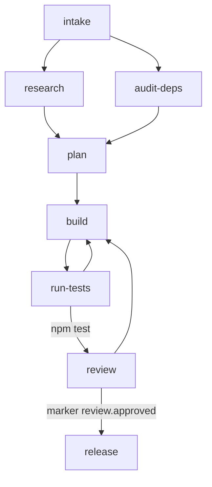

<div align="center">

# skill-graph

### Deterministic, n8n style workflows for AI coding agents

Wire your agent's work as a graph of skills, then let a hook enforce it while the agent runs.

</div>

---

## What it is

skill-graph lets you describe an agent workflow as a directed graph of skill nodes. A hook then runs
that graph as a **session governor**. On every tool call it checks where the agent is and whether the
call is allowed. It blocks anything that leaves the graph and tells the agent why. It holds parallel
branches at a join, runs bounded loops, and draws the whole thing as a Mermaid diagram.

Think of it as n8n for your coding harness. You design the flow once, and the run follows it. The
difference from a prompt is that the rules are binding and the decisions are deterministic, decided by
a pure function rather than the model's goodwill.

## A workflow

```js
import { workflow, fileExists, shell, marker } from "skill-graph"

const wf = workflow("ship-a-feature")

const intake   = wf.skill("intake",     { allowedTools: ["AskUserQuestion"] })
const research = wf.skill("research",   { allowedTools: ["Read", "Grep", "WebFetch"], doneWhen: fileExists("docs/research.md") })
const audit    = wf.skill("audit-deps", { allowedTools: ["Bash", "Read"], doneWhen: fileExists("docs/deps.md") })
const plan     = wf.skill("plan",       { join: "all", allowedTools: ["Write", "Read"], doneWhen: fileExists("PLAN.md") })
const build    = wf.skill("build",      { allowedTools: ["Edit", "Write", "Bash", "Read"] })
const tests    = wf.skill("run-tests",  { allowedTools: ["Bash"], loop: { max: 5, noProgress: true } })
const review   = wf.skill("review",     { allowedTools: ["Read", "Bash"], loop: { max: 3 } })
const release  = wf.skill("release",    { allowedTools: ["Bash"] })

intake.fork(research, audit)                        // research and the dependency audit run in parallel
plan.after(research, audit)                         // plan waits until both finish
plan.then(build)
build.then(tests)
tests.loopTo(build)                                 // a failing suite sends work back to build
tests.edge(review, { when: shell("npm test") })     // a green suite unlocks review
review.loopTo(build)                                // requested changes send work back to build
review.edge(release, { when: marker("review.approved") })

wf.root(intake)
export default wf
```



## Why

A capable agent still wanders. It explores when it should delegate, edits before it has a plan, calls
the job done while tests are red, or loops without end. skill-graph makes the shape of the work
explicit and binding.

- **Deterministic.** A pure reducer decides ordering, tool permissions, joins, and loop termination.
  A join waits. A loop is capped. A step that leaves the graph is blocked. Every time.
- **One file, visualized.** The workflow is the documentation. `toMermaid()` renders it.
- **Drop in.** It runs on the hook system your harness already has. Install, add one hook, write a workflow.
- **Portable.** A small core with thin adapters for Claude Code and Codex. Adding another harness is one short file.

## Install

```bash
npm install github:vy-labs/skill-graph
```

## Quickstart for Claude Code

1. Install the package.
2. Add the hook to `.claude/settings.json` (full snippet in [`examples/claude-code`](./examples/claude-code)):
   ```json
   { "hooks": {
     "PreToolUse":  [{ "matcher": "*", "hooks": [{ "type": "command", "command": "node node_modules/skill-graph/adapters/claude-code.mjs" }] }],
     "SessionStart":[{ "hooks": [{ "type": "command", "command": "node node_modules/skill-graph/adapters/claude-code.mjs" }] }]
   }}
   ```
   The `PreToolUse` hook is the enforcer and is required. The `SessionStart` hook is optional. It
   injects a short "you are here" note for resuming a run in progress, and you can leave it out.
3. Write a workflow at `.skill-graph/your.workflow.mjs` that default exports a `workflow()`.
4. Start the agent. The run begins when it enters the root skill, and the governor takes over.

Codex setup follows the same shape. See [`examples/codex`](./examples/codex).

## How it works

A node is a skill the agent invokes, named by its skill id. `allowedTools` limits the lead agent's
direct tools at that node, while subagents it delegates to run freely. A node finishes when its
`doneWhen` predicate holds (a file exists, a command passes, or a marker is written), or when the agent
moves on if it has no predicate. A node with more parents unlocks once its join is satisfied.

Edges carry optional guards for branching, and `loopTo` builds a back edge governed by the node's loop
policy. The loop policy stops on a maximum count, and stops early when two iterations report the same
failure, so a stuck loop never spins.

The governor runs on every tool call. It blocks calls that leave the graph and allows the rest. Run
state is keyed by git branch under `.skill-graph/.state`. When reality diverges from the plan, the
agent can invoke `Skill("workflow:override", { to: "<node>" })`, which is always allowed and recorded.

Full reference: [docs/dsl.md](./docs/dsl.md). Hands on guide: [docs/guide.md](./docs/guide.md).

## Harness support

| Harness | Adapter | Status |
|---|---|---|
| Claude Code | `adapters/claude-code.mjs` | supported |
| Codex | `adapters/codex.mjs` | supported. Confirm the hook config path for your version. |
| Gemini, Cursor, Copilot, others | add a short adapter over the shared core | open |

## License

MIT, vy-labs.
