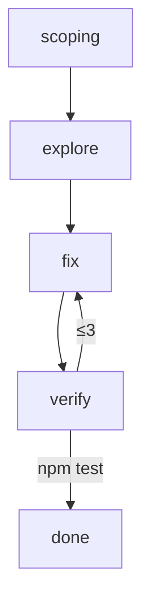

# skill-graph

**Workflow automation for AI coding agents — think n8n, but for your coding harness.**

Define an agent workflow as a directed graph of skill-nodes, and `skill-graph` enforces it as a
deterministic **session governor**: it tracks where the agent is, **denies** tool/skill calls that go
off-graph (with a reason), holds **join barriers**, runs bounded **loops**, and renders the graph to
Mermaid. It works by a hook your harness already supports — no service, no daemon, no rewrite of your
agent.

Pure ESM, **harness-agnostic core** with thin adapters for **Claude Code** and **Codex** (more are a
~40-line file away). No build, no runtime dependencies.

```js
import { workflow, fileExists, shell } from "skill-graph"

const wf = workflow("review")
const scope   = wf.skill("scoping", { allowedTools: ["AskUserQuestion"] })
const explore = wf.skill("explore", { allowedTools: ["Read", "Grep", "Glob"], doneWhen: fileExists("NOTES.md") })
const fix     = wf.skill("fix",     { allowedTools: ["Edit", "Write", "Bash", "Read"] })
const verify  = wf.skill("verify",  { allowedTools: ["Bash"], loop: { max: 3, noProgress: true } })
const done    = wf.skill("done")

scope.then(explore); explore.then(fix); fix.then(verify)
verify.loopTo(fix)                          // tests fail → loop back (bounded)
verify.edge(done, { when: shell("npm test") })  // tests pass → done
wf.root(scope)
export default wf
```



## Why

A capable agent still wanders: it explores when it should have delegated, edits before it has a plan,
declares done while tests are red, or loops forever. `skill-graph` makes the *shape* of the work
explicit and **binding** — the rules live in one readable file, they're enforced deterministically by a
hook (not by hoping the model complies), and you can see them as a diagram.

- **Deterministic.** Termination, ordering, and tool permissions are decided by a pure function, not
  the model. A join waits; a loop is capped; an off-graph step is denied — every time.
- **One file, visualized.** The workflow *is* the documentation. `toMermaid()` draws it.
- **Drop-in.** It rides your harness's existing hook system. Install, add one hook, write a workflow.

## Install

```bash
npm install github:vy-labs/skill-graph
```

## Quickstart (Claude Code)

1. `npm install github:vy-labs/skill-graph`
2. Add the hook to `.claude/settings.json` (see [`examples/claude-code/`](./examples/claude-code/)):
   ```json
   { "hooks": {
     "PreToolUse":  [{ "matcher": "*", "hooks": [{ "type": "command", "command": "node node_modules/skill-graph/adapters/claude-code.mjs" }] }],
     "SessionStart":[{ "hooks": [{ "type": "command", "command": "node node_modules/skill-graph/adapters/claude-code.mjs" }] }]
   }}
   ```
3. Write `.skill-graph/<name>.workflow.js` (a default-exported `workflow()` that `import`s `skill-graph`).
4. Start your agent. Entering the root skill starts the run; the governor takes it from there.

Codex setup is the same shape — see [`examples/codex/`](./examples/codex/).

## How it works

- A **node** is a skill your agent invokes; its name is the skill id. `allowedTools` limits the lead's
  *direct* tools while at that node (delegated subagents run free).
- A node completes via a **`doneWhen` predicate** (`fileExists` / `shell` exit-0 / `marker`) or, if it
  has none, when the agent legally moves on. Successors unlock when their **join** is satisfied.
- **Edges** can be guarded (`{ when: <predicate> }`) for deterministic branching; **`loopTo`** makes a
  back-edge governed by the node's `loop` policy (`max` iterations + same-signature **no-progress** stop).
- The governor runs on `PreToolUse`: it **denies** off-graph calls with guidance, and **allows** the
  rest. State is branch-keyed under `.skill-graph/.state/`. An always-allowed `workflow:override`
  escape hatch (logged) lets the agent leave the graph when reality diverges.

Full reference: [docs/dsl.md](./docs/dsl.md). End-to-end guide: [docs/guide.md](./docs/guide.md).

## Harness support

| Harness | Adapter | Status |
|---|---|---|
| Claude Code | `adapters/claude-code.mjs` | supported |
| Codex | `adapters/codex.mjs` | supported (validate hook-config path for your version) |
| Gemini / Cursor / Copilot / … | — | add a ~40-line adapter over the shared core |

## License

MIT © vy-labs
